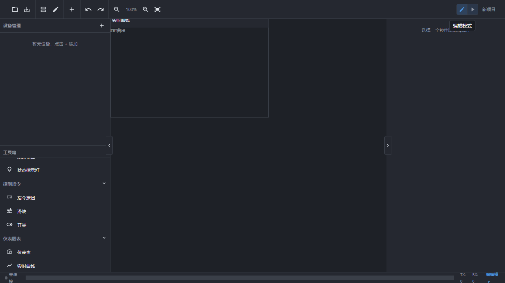
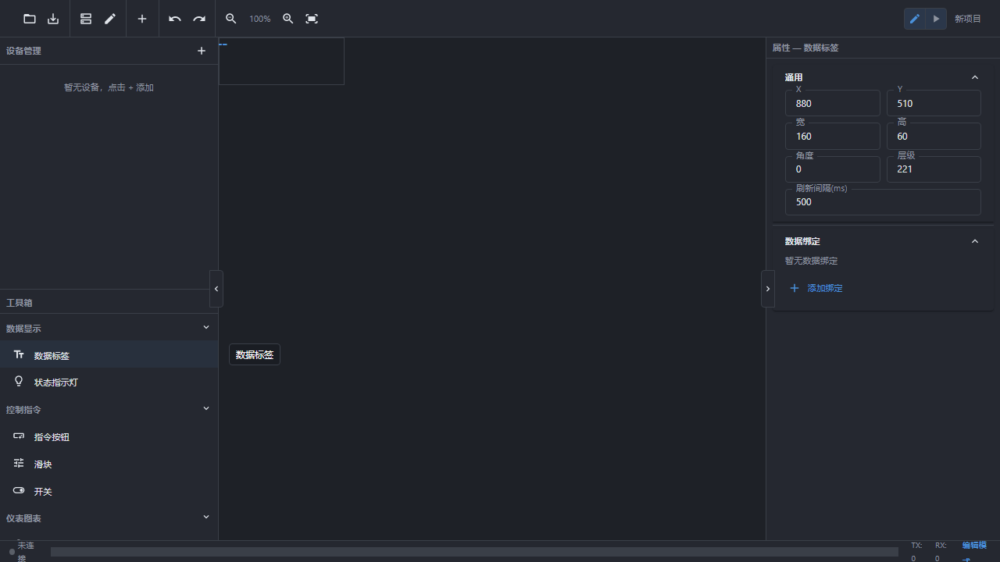
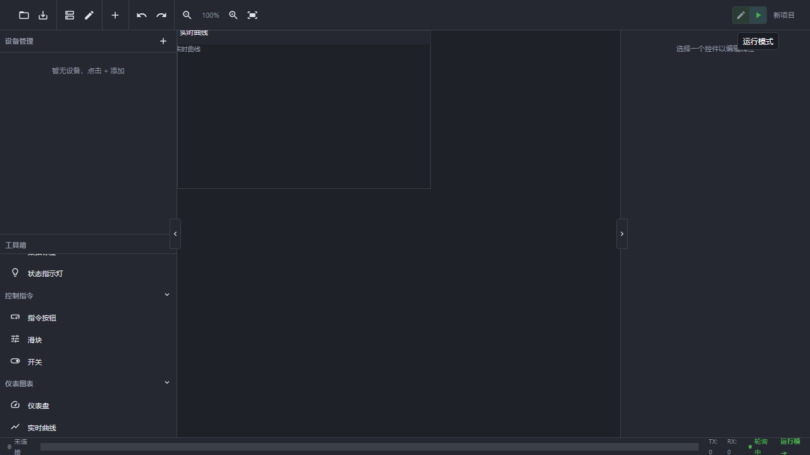

# Studio 0 — Modbus 调试工具

<p align="center">
  <strong>专业级 Modbus 协议调试与仿真工具</strong><br/>
  
  
  
  
  
</p>

<div align="center">
  <strong>🌐 语言 / Language：</strong>
  <a href="README.md"><b>🇨🇳 中文</b></a> | <a href="README_EN.md">🇺🇸 English</a>
</div>

---

## 🔖 标签 / Tags

<div align="center">

| 中文标签 | English Tag | 说明 |
|---------|-------------|------|
| 🐍 **Python** | `python` | 基于 Python 3.12 / PyQt5 构建 |
| 📡 **Modbus** | `modbus` | 支持 RTU / TCP / ASCII 三协议 |
| 🎨 **免代码** | `no-code` | 视觉化拖拽组态，零编程做 HMI 界面 |
| ✏️ **弱代码** | `low-code` | 内置 Python 脚本引擎，自动化扩展 |
| ⚙️ **自定义** | `custom` | 控件属性完全可配置（位置/颜色/字体/刷新率）|
| 📊 **HMI 组态** | `hmi` / `scada` | 工业人机界面 / 数据可视化 |
| 🏭 **工业自动化** | `industrial` / `iot` | 面向工控、物联网场景 |

</div>

---

## 📖 目录

- [产品简介](#产品简介)
- [⭐ 免代码图形组态（核心亮点）](#-免代码图形组态核心亮点)
- [系统要求](#系统要求)
- [下载与安装](#下载与安装)
- [快速上手（5 分钟入门）](#快速上手5-分钟入门)
- [功能详解](#功能详解)
  - [协议支持](#协议支持)
  - [数据采集监控](#数据采集监控)
  - [指令下发](#指令下发)
  - [从站仿真](#从站仿真)
  - [多设备管理](#多设备管理)
  - [数据日志](#数据日志)
  - [报警系统](#报警系统)
  - [脚本自动化（弱代码）](#脚本自动化弱代码)
- [界面指南](#界面指南)
- [数据配置详解](#数据配置详解)
- [连接参数说明](#连接参数说明)
- [常见问题 FAQ](#常见问题-faq)
- [版本历史](#版本历史)
- [软件许可](#软件许可)
- [反馈与交流](#反馈与交流)
- [支持作者](#支持作者)

---

## 产品简介

**Studio 0** 是一款基于 **Python / PyQt5** 构建的专业级 Modbus 协议调试与仿真工具，面向工业自动化领域的工程师、设备集成商和研发人员设计。

### 技术栈

| 组件 | 技术 | 版本 |
|------|------|------|
| **开发语言** | Python | 3.12+ |
| **UI 框架** | PyQt5 | 5.15+ |
| **Modbus 协议栈** | 自研实现（pymodbus） | — |
| **打包分发** | PyInstaller | 单 exe，无需用户装 Python |

### 核心定位：免代码 + 弱代码

Studio 0 的核心理念是**让不懂编程的人也能做出专业的工业监控界面**：

- **🎨 免代码（No‑Code）**：通过**可视化拖拽组态编辑器**，从左侧工具箱选取控件 → 拖到画布 → 绑定数据点 → 调整样式 → 一键运行。全程无需写一行代码。
- **✏️ 弱代码（Low‑Code）**：内置 **Python 脚本引擎**，支持定时任务、条件触发、数据运算等高级自动化。语法接近标准 Python，学习成本低。

### 适用场景

| 场景 | 说明 |
|------|------|
| **设备联调** | 连接 PLC、变频器、仪表等 Modbus 设备，实时读写数据 |
| **协议分析** | 捕获并解析 Modbus 报文，定位通讯故障 |
| **从站仿真** | 模拟 Modbus 从设备，供上位机/主站调用测试 |
| **功能验证** | 在没有物理设备的情况下验证上位机软件的 Modbus 通讯逻辑 |
| **教学学习** | 理解 Modbus 协议的工作原理和数据格式 |
| **HMI 原型** | 快速搭建工业监控界面原型（免代码组态）|

### 核心优势

- ✅ **三协议全覆盖** — RTU / TCP / ASCII 一站式支持
- ✅ **主从双模式** — 既可做主站采集数据，也可做从站响应请求
- ✅ **开箱即用** — 无需安装 Python 或任何依赖，解压即运行
- ✅ **免费使用** — 个人和商业用途均可免费使用
- ✅ **免代码组态** — 拖拽式 HMI 编辑器，30 种+ 可视化控件
- ✅ **弱代码脚本** — 内置 Python 引擎，自动化扩展无上限
- ✅ **完整日志** — 所有通讯报文全程记录，支持导出分析

---

## ⭐ 免代码图形组态（核心亮点）

> 💡 **这是 Studio 0 最具差异化的功能** —— 你不需要会编程，就能在几分钟内搭建出专业级的工业监控界面。

### 工作原理

Studio 0 内置了一个**所见即所得的组态编辑器**：

1. 从左侧**控件工具箱**中选取需要的控件类型
2. **拖拽**到中央画布上放置
3. 在右侧**属性面板**中配置控件的位置、大小、颜色、字体、刷新周期等
4. 将控件**绑定**到已配置的 Modbus 数据点
5. 点击右上角 **「运行模式」** 按钮，即可看到实时数据驱动的动态界面

### 👁️ 编辑器实拍

下图是 Studio 0 组态编辑器的实际界面（**编辑模式**）：

<p align="center">
  
  <br/><em>▲ 组态编辑器全景：左侧控件工具箱 · 中央画布 · 右侧属性面板 · 顶部工具栏</em>
</p>

可以看到：
- **左侧工具箱**按类别组织了所有可用控件（数据显示 / 状态指示 / 控制指令 / 滑块 / 开关 / 仪表图表）
- **中央画布**是你拖放控件、布局界面的区域
- **右侧属性面板**让你精确控制每个控件的每一个细节
- **顶部工具栏**提供保存、撤销/重做、缩放、新建项目等操作

### 控件绑定数据实拍

选中一个控件后，右侧属性面板显示其完整配置项。下图展示了**「数据标签」控件的属性配置**：

<p align="center">
  
  <br/><em>▲ 数据标签控件：配置位置(X/Y)、尺寸(宽/高)、角度、刷新间隔、数据绑定</em>
</p>

所有配置都是**图形化的表单操作** —— 填数字、选下拉框、勾复选框，完全不需要写代码。

### 运行模式切换

编辑完成后，点击右上角按钮即可一键切换到**运行模式**，查看最终效果：

<p align="center">
  
  <br/><em>▲ 「运行模式」按钮：点击后画布进入实时数据驱动状态</em>
</p>

---

### 🧩 完整控件清单

Studio 0 的组态编辑器提供 **6 大类、30+ 种**可视化控件，覆盖工业 HMI 的所有常见需求：

#### ① 数据显示类（Data Display）

| 控件 | 功能描述 | 适用数据 |
|------|----------|----------|
| **📊 数据标签** | 显示单个实时数值（支持整数/浮点/十六进制/字符串）| 温度、压力、转速等单值 |
| **📝 静态文本** | 固定文字标注（标题、单位、说明）| 界面装饰文字 |
| **📋 多行表格** | 以表格形式同时展示多条数据寄存器 | 批量寄存器查看 |
| **📅 日期时间** | 显示当前系统时间或设备时间戳 | 时间戳展示 |
| **🔢 算术和** | 对多个数据点求和/求平均/取极值 | 能耗统计、汇总计算 |

#### ② 状态指示类（Status Indicator）

| 控件 | 功能描述 | 适用数据 |
|------|----------|----------|
| **🔴 状态灯** | 根据数值/枚举值变色（红/黄/绿）+ 可选闪烁 | 运行/停止/告警状态 |
| **🏷️ 状态标签** | 文字+背景色联动变化（多态显示）| 设备工况文字提示 |
| **📡 设备状态** | 综合展示设备在线/离线/通讯异常 | 连接状态总览 |
| **🔋 电量** | 电池图标 + 百分比显示 | 移动设备电量 |

#### ③ 指令下发类（Command）

| 控件 | 功能描述 | 适用数据 |
|------|----------|----------|
| **🔘 指令按钮** | 点击即发送预设写指令（支持确认对话框）| 启停控制、复位 |
| **🔄 自复位按钮** | 按下后自动弹回（脉冲式触发）| 点动控制、步进 |
| **📋 指令表** | 表格形式批量下发多个寄存器值 | 参数批量设置 |
| **⚡ 批量控制** | 一键对多设备/多点下发相同值 | 全局启停、统一设定 |
| **📥 下拉列表** | 下拉选择预设值后下发 | 模式切换、档位选择 |

#### ④ 交互调节类（Interaction）

| 控件 | 功能描述 | 适用数据 |
|------|----------|----------|
| **🎚️ 滑块** | 拖动滑块连续调节数值（实时下发）| PID 设定值、亮度调节 |
| **🔘 开关** | ON/OFF 切换开关（Toggle 样式）| 启停、使能控制 |
| **🎮 图形开关** | 自定义图标的触摸式开关 | 自定义 UI 风格 |

#### ⑤ 仪表显示类（Instrument）

| 控件 | 功能描述 | 适用数据 |
|------|----------|----------|
| **🎯 仪表盘** | 经典指针式圆形仪表（可设刻度/区间/指针颜色）| 转速、压力、流量 |
| **🚗 速度仪** | 半圆弧形速度仪表（类似车速表）| 电机转速、线速度 |
| **🔄 数值盘** | 圆形数字转盘（大字号居中显示）| 核心参数醒目展示 |
| **📐 进度盘** | 圆形进度环（百分比/占比）| 完成率、利用率 |
| **▬ 进度条** | 水平/垂直进度条 | 液位、装载量 |
| **🌡️ 温度计** | 温度计造型控件（带刻度）| 温度直观展示 |
| **🧭 指南针** | 方位角指示（N/S/E/W + 角度数值）| 风向、天线方位 |

#### ⑥ 图表统计类（Chart）

| 控件 | 功能描述 | 适用数据 |
|------|----------|----------|
| **🍩 环形图/饼图** | 占比分布图（多数据源占比）| 能耗分布、故障分类 |
| **📈 实时曲线** | 时间序列折线图（滚动更新）| 趋势监控、波形观察 |
| **📉 历史曲线** | 带时间轴的历史数据回放曲线 | 历史趋势分析 |
| **📊 柱状图** | 多通道柱状对比图 | 多设备对比 |
| **⚬ 散点图** | XY 散点分布图 | 相关性分析 |

#### ⑦ 辅助装饰类（Decoration）

| 控件 | 功能描述 |
|------|----------|
| **📑 页面标签** | 多页面切换标签页 |
| **➖ 分割线** | 区域分隔装饰线 |
| **〰️ 流动线** | 动态流动效果（管道介质流向示意）|
| **🖼️ 底图** | 背景图片（设备布局图/工艺流程图）|

---

### 每个控件的通用属性

无论哪种控件，都支持以下**通用基本参数**的图形化配置：

| 参数 | 说明 | 示例 |
|------|------|------|
| **X / Y** | 控件在画布上的坐标位置 | X=100, Y=200 |
| **宽度 / 高度** | 控件尺寸（像素）| 宽=160, 高=60 |
| **角度** | 旋转角度（度）| 0（正）、45（斜）、90（竖）|
| **刷新间隔(ms)** | 数据更新频率 | 500（快）~ 5000（慢）|
| **数据绑定** | 关联哪个 Modbus 数据点 | 选择已配置的数据点 |

此外每种控件还有**专属扩展参数**（如仪表盘的最小值/最大值/刻度数、状态灯的颜色映射表、曲线图的采样间隔等），全部在右侧属性面板中以表单形式呈现。

---

## 系统要求

### 最低配置

| 项目 | 要求 |
|------|------|
| **操作系统** | Windows 7 SP1 / Windows Server 2012 R2 及以上 |
| **处理器** | x86_64 架构，1 GHz 以上 |
| **内存** | 2 GB RAM |
| **硬盘空间** | 200 MB 可用空间（含程序 + 运行时 + 配置） |
| **显示器** | 1024×768 分辨率及以上 |

### 推荐配置

| 项目 | 要求 |
|------|------|
| **操作系统** | Windows 10 / Windows 11 (64-bit) |
| **处理器** | 2 核心以上 |
| **内存** | 4 GB RAM 或更多 |
| **显示器** | 1920×1080 或更高分辨率 |

### 注意事项

- ⚠️ 本软件仅支持 **Windows** 操作系统，不支持 macOS 或 Linux
- ⚠️ 建议安装路径和使用路径**不包含中文或特殊字符**
- ⚠️ 首次启动可能需要几秒钟初始化时间（加载 UI 组件）
- ⚠️ 如遇杀毒软件拦截，请将程序目录添加到白名单（误报为 Python 打包程序）

---

## 下载与安装

### 第一步：下载

1. 访问本仓库的 [Releases](https://github.com/EveryIsZero/Studio-0/releases) 页面
2. 找到最新版本的 `Studio 0 Release 4.3.4.44.zip` 文件
3. 点击下载（约 40 MB）

### 第二步：解压

1. 将下载的 zip 文件解压到任意目录
   - 推荐：`D:\Studio 0\` 或 `C:\Tools\Studio 0\`
   - ❌ 不推荐：桌面、中文路径较深的目录（如 `C:\用户\张三\下载\`）
2. 解压后应看到以下文件和文件夹：

```
Studio 0/
├── Studio 0.exe           ← 主程序（双击此文件启动）
├── _internal/             ← 运行时依赖（勿删除、勿移动）
│   └── （Python 运行时文件）
├── cfg/                   ← 用户配置（首次运行后自动生成）
├── 微信捐赠码.png         ← 捐赠码（微信），与 exe 同级
├── 支付宝捐赠码.jpg       ← 捐赠码（支付宝），与 exe 同级
└── manual.html            ← 中英文双语说明书（可切换语言，离线可用）
```

> ⚠️ **重要**：`Studio 0.exe` 必须与 `_internal/` 文件夹在**同一级目录**下。如果分离或删除 `_internal/`，程序将无法启动。

### 第三步：启动

双击 `Studio 0.exe` 即可启动程序。

首次启动时会自动完成以下初始化：
- 创建 `cfg/` 配置目录
- 生成默认配置文件
- 初始化数据库

---

## 快速上手（5 分钟入门）

按照以下步骤，你可以在 5 分钟内完成一次完整的 Modbus 数据采集操作：

### 📌 前置条件

你需要一台支持 Modbus 协议的设备（或使用从站仿真模式自测）。以下示例以 **Modbus RTU 串口连接**为例。

### Step 1：新建连接（30 秒）

1. 启动 Studio 0 后，点击工具栏上的 **「新建连接」** 按钮
2. 在弹出的对话框中选择协议类型：
   - 选择 **「RTU」**（串口模式）
3. 配置串口参数：
   - **端口号**：选择你的设备所在的 COM 口（如 `COM3`）
   - **波特率**：与设备一致（常见值 `9600` / `19200` / `38400` / `115200`）
   - **数据位**：通常 `8`
   - **停止位**：通常 `1`
   - **校验位**：通常 `None`（无校验）
4. 点击 **「确定」** 保存连接配置

### Step 2：添加数据点（1 分钟）

1. 在主界面的数据配置区域，点击 **「添加数据点」**
2. 填写以下信息：

   | 参数 | 说明 | 示例 |
   |------|------|------|
   | **从站地址** | 目标设备的 Modbus 地址 | `1` |
   | **功能码** | 要执行的操作类型 | `03`（读保持寄存器）|
   | **起始地址** | 寄存器起始地址（十进制）| `0` |
   | **数量** | 要读取的寄存器个数 | `10` |
   | **数据类型** | 解析方式 | `INT16`（16位有符号整数）|

3. 点击 **「确认」** 添加该数据点
4. 可重复添加多个数据点

### Step 3：开始采集（10 秒）

1. 点击工具栏的 **「连接」** 按钮建立通讯
2. 选中要采集的数据点
3. 点击 **「启动采集」**
4. 数据区域会开始显示实时数值，按设定的刷新周期更新

### Step 4：写入数据（30 秒）

1. 在数据列表中找到要修改的数据项
2. **双击数值列**（或右键 → 「写入」）
3. 输入新值
4. 点击 **「确认下发」**
5. 观察返回结果（成功/失败及错误码）

### Step 5：查看日志（随时）

1. 切换到 **「通讯日志」** 面板
2. 可以看到所有收发的 Modbus 报文（十六进制原始数据 + 解析后的字段）
3. 日志支持 **复制** 和 **导出** 为文本文件

> 💡 **提示**：如果暂时没有物理设备，可以使用内置的 **从站仿真模式** 自测——在菜单中选择「从站模式」，配置本地数据映射表，然后用另一个连接窗口作为主站去访问它。

---

## 功能详解

### 协议支持

Studio 0 完整支持 Modbus 协议的三种主流传输方式：

#### Modbus RTU（串口）

| 参数 | 说明 |
|------|------|
| **传输介质** | RS-232 / RS-485 / RS-422 |
| **物理接口** | 串口（COM 口）|
| **典型应用** | 工业现场设备、PLC、变频器、仪表 |
| **帧结构** | 地址 + 功能码 + 数据 + CRC 校验 |
| **特点** | 二进制紧凑格式，传输效率高，工业最常用 |

**常用串口参数组合：**

| 场景 | 波特率 | 数据位 | 停止位 | 校验 |
|------|--------|--------|--------|------|
| 默认标准 | 9600 | 8 | 1 | None |
| 高速通信 | 115200 | 8 | 1 | None |
| 老旧设备 | 4800 | 7 | 2 | Even |

#### Modbus TCP（以太网）

| 参数 | 说明 |
|------|------|
| **传输介质** | 以太网（TCP/IP）|
| **连接方式** | IP 地址 + 端口号 |
| **默认端口** | `502`（Modbus 标准）|
| **典型应用** | 以太网联网的 PLC、远程 I/O、网关设备 |
| **帧结构** | MBAP 头 + PDU（功能码 + 数据）|
| **特点** | 基于 TCP 可靠传输，支持网络路由 |

**连接配置示例：**

```
IP 地址: 192.168.1.100
端口:   502（标准 Modbus 端口）
超时:   3000 ms
```

#### Modbus ASCII（串口）

| 参数 | 说明 |
|------|------|
| **传输介质** | RS-232 / RS-485 |
| **物理接口** | 串口（COM 口）|
| **编码方式** | ASCII 字符（每个字节两个 ASCII 字符表示）|
| **帧定界** | 冒号 `:` 开始，回车换行 `CR LF` 结束 |
| **校验方式** | LRC（纵向冗余校验）|
| **特点** | 可读性好，适合调试诊断，但传输效率低于 RTU |

> 💡 **如何选择协议？** 如果设备手册没有特别说明，绝大多数工业设备使用的是 **Modbus RTU**。以太网设备通常使用 **Modbus TCP**。ASCII 模式较少见，主要用于需要人工观察报文的调试场景。

---

### 数据采集监控

数据采集是 Studio 0 的核心功能之一，支持对 Modbus 设备的各类数据进行周期性读取和实时展示。

#### 支持的数据类型

| 类型 | 说明 | 取值范围 | 典型用途 |
|------|------|----------|----------|
| **INT16** | 16 位有符号整数 | -32768 ~ 32767 | 温度、压力传感器 |
| **UINT16** | 16 位无符号整数 | 0 ~ 65535 | 状态字、计数值 |
| **INT32** | 32 位有符号整数 | ±21 亿 | 大范围测量值 |
| **UINT32** | 32 位无符号整数 | 0 ~ 42 亿 | 累加器、时间戳 |
| **FLOAT32** | IEEE 754 单精度浮点 | ±3.4E38 | 精确测量值、设定值 |
| **FLOAT64** | IEEE 754 双精度浮点 | ±1.7E308 | 高精度计算 |
| **HEX** | 十六进制显示 | 0x0000 ~ 0xFFFF | 原始寄存器值 |
| **STRING** | ASCII 字符串 | 可变长度 | 设备型号、描述信息 |
| **BYTE ARRAY** | 字节数组 | 可变长度 | 二进制数据块 |
| **BIT** | 单个位 | 0 / 1 | 开关量、标志位 |

#### 支持的功能码

| 功能码 | 名称 | 方向 | 说明 |
|--------|------|------|------|
| **01** | 读线圈 | 读 | 读取开关量输出状态 |
| **02** | 读离散输入 | 读 | 读取开关量输入状态 |
| **03** | 读保持寄存器 | 读 | 读取模拟量/参数（最常用）|
| **04** | 读输入寄存器 | 读 | 读取只读模拟量 |
| **05** | 写单个线圈 | 写 | 控制单个开关量输出 |
| **06** | 写单个寄存器 | 写 | 设置单个参数值 |
| **0F (15)** | 写多个线圈 | 写 | 批量控制开关量 |
| **10 (16)** | 写多个寄存器 | 写 | 批量设置参数值 |

#### 数据系数与转换

在实际工程中，设备内部存储的原始值往往需要经过换算才能得到实际物理量。Studio 0 支持**数据系数**配置：

```
实际值 = 原始值 × 系数 + 偏移量
```

**示例：温度传感器换算**

| 参数 | 值 | 说明 |
|------|-----|------|
| 原始值 | `2500` | 从设备读到的寄存器值 |
| 系数 | `0.01` | 设备规定每个单位代表 0.01°C |
| 偏移量 | `0` | 无偏移 |
| **实际值** | **25.00 °C** | 显示给用户的真实温度 |

#### 字节序设置

不同厂商的 Modbus 设备可能采用不同的字节序（大端/小端），导致多字节数据解析错误。Studio 0 支持以下字节序配置：

| 字节序 | 说明 | 适用场景 |
|--------|------|----------|
| **ABCD** (大端) | 高字节在前 | Modbus 标准、大多数 PLC |
| **DCBA** (小端) | 低字节在前 | 部分 Intel 架构设备 |
| **BADC** | 字交换 | 特殊厂商设备 |
| **CDAB** | 双字交换 | 特殊厂商设备 |

> 💡 **排查技巧**：如果读到的浮点数值看起来不合理（如极大/极小/NaN），通常是字节序不对。尝试切换字节序即可解决。

---

### 指令下发

除了被动读取数据，Studio 0 还支持主动向设备发送写指令，用于控制设备和修改参数。

#### 下发方式

| 方式 | 操作 | 适用场景 |
|------|------|----------|
| **单点写入** | 双击数值 → 输入新值 → 确认 | 修改单个参数 |
| **批量写入** | 选中多个数据点 → 批量下发 | 同时设置多个参数 |
| **指令按钮** | 在组态界面放置按钮 → 点击即下发 | 频繁操作的快捷控制 |
| **滑块调节** | 拖动滑块 → 实时连续下发 | 调节设定值（如 PID 目标值）|

#### 下发安全机制

- ✅ 下发前会弹出确认对话框，防止误操作
- ✅ 显示上一次成功读取的值作为参考
- ✅ 支持设置**写入权限密码**（可选）
- ✅ 所有写入操作记录在通讯日志中，可追溯

---

### 从站仿真

从站仿真模式让你可以在**没有物理设备**的情况下测试 Modbus 通讯逻辑。

#### 工作原理

Studio 0 作为 **Modbus 从站（Slave）** 运行，监听来自主站的请求并根据预设的**数据映射表**返回响应。

#### 使用步骤

1. 在菜单中选择 **「从站模式」** 或点击工具栏的从站切换按钮
2. 配置从站参数：
   - **从站地址**：本机作为从站的地址（如 `1`）
   - **监听端口/串口**：根据协议类型选择
3. 定义**数据映射表**：
   - 为每个地址范围指定初始值和数据类型
   - 例如：地址 0~9 为 INT32，初始值全部为 0
4. 启动从站监听
5. 用另一台设备（或本机的另一个连接窗口）作为主站连接并读写数据

#### 应用场景

- 🔧 上位机软件开发阶段的模拟测试
- 📚 学习 Modbus 协议的交互过程
- 🧪 复现现场通讯问题的调试环境
- ✅ 自动化测试中的虚拟从站节点

---

### 多设备管理

Studio 0 支持**同时连接和管理多台 Modbus 设备**，每台设备独立配置参数。

#### 功能特性

- 每台设备独立的连接参数（IP/端口/串口设置）
- 每台设备独立的数据点列表
- 每台设备独立的采集周期配置
- 设备间互不影响，某台断连不影响其他设备
- 支持设备分组和标签管理

#### 使用建议

| 设备数量 | 建议方案 |
|----------|----------|
| 1~5 台 | 直接在主界面分标签页管理 |
| 6~20 台 | 使用设备分组功能归类 |
| 20+ 台 | 建议分多个项目文件管理 |

---

### 数据日志

Studio 0 自动记录所有 Modbus 通讯的完整报文数据。

#### 日志内容

每条日志包含以下信息：

| 字段 | 说明 |
|------|------|
| **时间戳** | 精确到毫秒的收发时间 |
| **方向** | 发送(TX) / 接收(RX) |
| **原始报文** | 十六进制格式的完整帧数据 |
| **解析结果** | 地址、功能码、数据内容的文字解读 |
| **耗时** | 从发出请求到收到响应的时间（毫秒）|

#### 日志操作

- **实时查看**：在通讯日志面板中滚动浏览
- **过滤搜索**：按时间范围、方向、功能码筛选
- **导出功能**：导出为 `.txt` / `.csv` 文件，可用 Excel 打开分析
- **清空日志**：一键清除当前缓冲区（不影响已导出的内容）

> 💡 **调试技巧**：当通讯出现问题时，首先查看日志中的原始报文。对比请求和响应的十六进制数据，可以快速判断是设备没响应、响应超时还是返回了异常码。

---

### 报警系统

Studio 0 内置多级阈值报警功能，帮助你在数据异常时及时获得通知。

#### 报警类型

| 类型 | 触发条件 | 示例 |
|------|----------|------|
| **上限报警** | 数值超过设定上限 | 温度 > 80°C |
| **下限报警** | 数值低于设定下限 | 压力 < 0.1 MPa |
| **偏差报警** | 偏离目标值过多 | ±5% 以外 |
| **变化率报警** | 数值变化过快 | 1秒内变化 > 10 |

#### 通知方式

| 方式 | 说明 |
|------|------|
| **声音提示** | 播放报警音效（可在设置中自定义）|
| **弹窗提醒** | 屏幕中央弹出报警详情窗口 |
| **日志记录** | 所有报警事件记入报警日志 |
| **颜色标记** | 数据列表中越限值高亮显示 |

#### 报警配置

1. 在数据点上右键 → **「设置报警」**
2. 选择报警类型和阈值
3. 选择通知方式
4. 启用/禁用该报警规则

---

### 图形组态

Studio 0 提供丰富的图形化数据展示控件，让你的数据一目了然。

#### 可用控件

| 控件 | 用途 | 数据要求 |
|------|------|----------|
| **数据标签** | 显示实时数值 | 单条数据 |
| **仪表盘** | 模拟指针式仪表 | 单条模拟量 |
| **进度条/进度盘** | 百分比或占比显示 | 有上下限的量 |
| **曲线图** | 历史趋势追踪 | 时间序列数据 |
| **柱状图** | 多通道对比 | 多条数据 |
| **状态灯** | 开关量指示 | 0/1 或枚举值 |
| **指令按钮** | 一键下发指令 | 可写数据点 |

#### 组态操作

1. 进入 **「组态编辑」** 模式
2. 从控件面板拖拽所需控件到画布
3. 双击控件绑定数据点和设置属性
4. 调整布局、颜色、字体等外观
5. 保存组态方案并切换到运行模式查看效果

---

### 脚本自动化

Studio 0 内置脚本引擎，支持通过脚本实现自动化任务。

#### 支持的能力

- 定时执行数据采集和写入
- 条件触发（当某个值满足条件时执行动作）
- 数据运算和处理
- 循环批量操作
- 与外部系统对接（HTTP 请求、文件读写）

#### 使用方式

1. 打开 **「脚本编辑器」**
2. 编写自动化脚本（类 Python 语法）
3. 设置触发条件（定时/手动/事件驱动）
4. 启动脚本执行
5. 在输出面板查看执行结果

> 📌 **注意**：脚本功能属于高级功能，建议熟悉基本操作后再使用。

---

## 界面指南

Studio 0 的主界面分为以下几个功能区域：

```
┌─────────────────────────────────────────────────────┐
│  菜单栏  File | Edit | View | Tools | Help          │
├─────────────────────────────────────────────────────┤
│  工具栏  [新建] [连接] [断开] [采集] [停止] [...]   │
├──────────┬──────────────────────┬───────────────────┤
│          │                      │                   │
│  设备    │    数据列表区域       │    详情/图表      │
│  树形    │    (地址/名称/       │    面板            │
│  列表    │     数值/质量/       │                   │
│          │     状态)            │                   │
│          │                      │                   │
│          ├──────────────────────┤                   │
│          │    通讯日志面板       │                   │
│          │    (TX/RX 报文)      │                   │
├──────────┴──────────────────────┴───────────────────┤
│  状态栏  已连接: COM3 @9600 | 设备数: 3 | 刷新: 1s  │
└─────────────────────────────────────────────────────┘
```

### 各区域说明

| 区域 | 功能 | 操作提示 |
|------|------|----------|
| **菜单栏** | 全局功能入口 | File 管理项目，View 切换视图 |
| **工具栏** | 常用操作快捷按钮 | 右键可自定义显示哪些按钮 |
| **设备树** | 左侧面板，显示所有已配置的设备连接 | 右键添加/删除/重命名设备 |
| **数据列表** | 中央主区域，显示所有数据点的实时值 | 双击数值可写入，右键可配置 |
| **详情面板** | 右侧区域，选中数据的详细信息 | 可切换为图表/日志视图 |
| **日志面板** | 底部区域，显示通讯报文 | 可拖动调整高度或关闭 |
| **状态栏** | 最底部，显示当前连接状态和统计信息 | 显示在线设备数、刷新频率等 |

---

## 数据配置详解

### 添加数据点时的完整参数

| 参数 | 是否必填 | 说明 | 示例 |
|------|----------|------|------|
| **名称** | 是 | 数据点的显示名称（方便识别）| "电机转速" |
| **从站地址** | 是 | 目标设备的 Modbus 从站 ID | `1` ~ `247` |
| **功能码** | 是 | 要执行的 Modbus 功能码 | `03` (读保持寄存器) |
| **起始地址** | 是 | 寄存器起始地址（十进制）| `0` |
| **数量** | 是 | 要读写的寄存器/线圈个数 | `10` |
| **数据类型** | 是 | 如何解析原始数据 | `INT16`, `FLOAT32` 等 |
| **系数** | 否 | 数据换算乘数（默认 1.0）| `0.01` |
| **偏移** | 否 | 数据换算偏移量（默认 0）| `0` |
| **字节序** | 否 | 多字节数据的字节排列顺序 | `ABCD`(大端) |
| **刷新周期** | 否 | 数据采集间隔（毫秒）| `1000` (1秒) |
| **只读** | 否 | 是否禁止写入该数据点 | 勾选后不可下发 |

### 地址计算

Modbus 地址有两种常见的表示方式，Studio 0 统一使用**从 0 开始的十进制地址**：

| 表示法 | 地址 0 | 地址 1 | 地址 400001 |
|--------|--------|--------|-------------|
| **从 0 开始（本软件）** | `0` | `1` | `400000` |
| **从 1 开始（部分设备手册）** | `0` 或 `1` | `1` 或 `2` | `400001` |

> 💡 **提示**：如果设备手册写的地址是 `400101`，在本软件中通常填 `400100`（减 1）。具体取决于设备厂商的约定，遇到问题时两种都试试。

---

## 连接参数说明

### RTU 串口连接参数

| 参数 | 说明 | 常见值 |
|------|------|--------|
| **端口号 (COM)** | 串口设备号 | COM1 ~ COM256 |
| **波特率 (Baud Rate)** | 通讯速率 | 9600, 19200, 38400, 115200 |
| **数据位 (Data Bits)** | 每帧数据位数 | 7, 8（通常 8）|
| **停止位 (Stop Bits)** | 帧结束标志位数 | 1, 1.5, 2（通常 1）|
| **校验 (Parity)** | 错误检测方式 | None, Odd, Even, Mark, Space |

### TCP 网络连接参数

| 参数 | 说明 | 常见值 |
|------|------|--------|
| **IP 地址** | 目标设备的网络地址 | 192.168.x.x |
| **端口号 (Port)** | Modbus TCP 服务端口 | 502（标准）|
| **连接超时** | 建立连接的最大等待时间 | 3000 ~ 10000 ms |
| **响应超时** | 等待设备响应的最长时间 | 1000 ~ 5000 ms |
| **重试次数** | 超时后自动重试的次数 | 0 ~ 3 |

### 通用参数

| 参数 | 说明 | 建议 |
|------|------|------|
| **从站地址范围** | 有效地址 | 1 ~ 247（0 为广播）|
| **帧间隔** | 连续发送两帧之间的最小间隔 | ≥ 10 ms（视设备而定）|

---

## 常见问题 FAQ

### Q1: 程序无法启动，闪退或报错？

**可能原因及解决方案：**

| 原因 | 解决方法 |
|------|----------|
| 缺少 `_internal/` 文件夹 | 确保 exe 和 _internal 在同一目录 |
| 杀毒软件拦截 | 将程序目录添加到杀软白名单/排除列表 |
| 缺少系统运行库 | 安装 [Visual C++ Redistributable](https://aka.ms/vs/17/release/vc_redist.x64.exe) |
| 中文路径问题 | 将程序移动到纯英文路径下 |

### Q2: 连接设备失败？

**排查步骤：**

1. **检查物理连接** — 串口线/网线是否插好？USB 转 485 的驱动是否安装？
2. **确认参数一致** — 波特率、数据位、校验、停止位必须与设备完全匹配
3. **确认端口号正确** — 在设备管理器中确认 COM 口编号（USB 转串口每次可能变）
4. **检查从站地址** — 确认目标设备的从站地址与你填写的一致
5. **用其他工具交叉验证** — 用已知可用的 Modbus 工具测试同一设备

### Q3: 读到的数据全为 0 或乱码？

**常见原因：**

- 从站地址不正确（读到了空设备或不存在的设备）
- 功能码选错（比如用了读输入寄存器 `04` 但数据在保持寄存器 `03` 中）
- 字节序不对（浮点数/长整型出现 NaN 或极大值）
- 地址偏移（设备手册的地址约定与本软件不一致）

### Q4: 写入数据失败？

**检查清单：**

- 设备是否支持该功能码的写操作？
- 该寄存器是否为只读？（很多设备的参数区是只读的）
- 是否需要在设备端先解锁写保护？
- 写入值是否在有效范围内？

### Q5: 通讯不稳定，经常超时？

**优化建议：**

| 问题 | 解决方案 |
|------|----------|
| 波特率过高导致误码 | 降低波特率（如 115200 → 9600）|
| 总线上设备太多 | 减少总线挂载或增加中继器 |
| 采集周期太快 | 增大刷新间隔（如 100ms → 1000ms）|
| 电缆过长或干扰 | 使用屏蔽双绞线，远离强电线路 |

### Q6: 如何备份和恢复我的配置？

Studio 0 的所有配置保存在 `cfg/` 目录下。**备份整个 `cfg/` 文件夹即可保存所有配置**（包括设备连接、数据点、组态布局等）。恢复时将备份的 `cfg/` 文件夹放回原位置即可。

---

## 版本历史

当前版本: **4.3.4.44** (v4.3.4.44)

| 版本 | 日期 | 说明 |
|------|------|------|
| **4.3.4.44** | 2025-06 | 首次公开发布版 |

> 详细变更记录请参见 Releases 页面或压缩包内的 `readme.txt`。

---

## 软件许可

本软件为 **免费软件（Freeware）**，供个人与商业用途免费使用。

### ✅ 你可以：
- 免费下载和使用本软件
- 分发原始的安装包（不得修改）
- 用于个人项目或商业项目

### ❌ 你不可以：
- 对本软件进行逆向工程或反编译
- 破解或绕过任何功能限制
- 将本软件或其组件用于非法用途
- 声称本软件是你开发的或去除版权标识
- **获取源代码**（本仓库不提供源代码）

### 版权声明

版权所有 © EveryIsZero。保留所有权利。
本软件"按原样"提供，不作任何明示或暗示的保证。

---

## 反馈与交流

### 问题反馈

使用中遇到 Bug 或有问题咨询，欢迎通过以下方式反馈：

- 📋 **GitHub Issues**: [提交 Issue](https://github.com/EveryIsZero/Studio-0/issues) — 首选方式，便于跟踪和回复
- 💬 请尽量包含以下信息以便快速定位问题：
  - 软件版本号
  - 操作系统版本
  - 设备型号和通讯参数
  - 问题现象截图
  - 通讯日志（如有报错）

### 功能建议

如果你希望看到新功能或有改进想法，同样欢迎在 Issues 中提出，标记为 `enhancement` 标签即可。

---

## ☕ 支持作者

如果 Studio 0 对你的工作有帮助，欢迎请作者喝杯咖啡 ☕ 你的支持是持续维护和更新的动力！

<p align="center">
  <table>
    <tr>
      <td align="center">
        <strong>微信支付</strong><br/><br/>
        <br/>
        <em>微信扫一扫</em>
      </td>
      <td width="40"></td>
      <td align="center">
        <strong>支付宝</strong><br/><br/>
        <br/>
        <em>支付宝扫一扫</em>
      </td>
    </tr>
  </table>
</p>

> 感谢每一位支持者！每一份捐赠都是对独立开发者最大的鼓励 ❤️

---

<p align="center">
  <sub>Made with ❤️ by <a href="https://github.com/EveryIsZero">EveryIsZero</a></sub>
</p>
