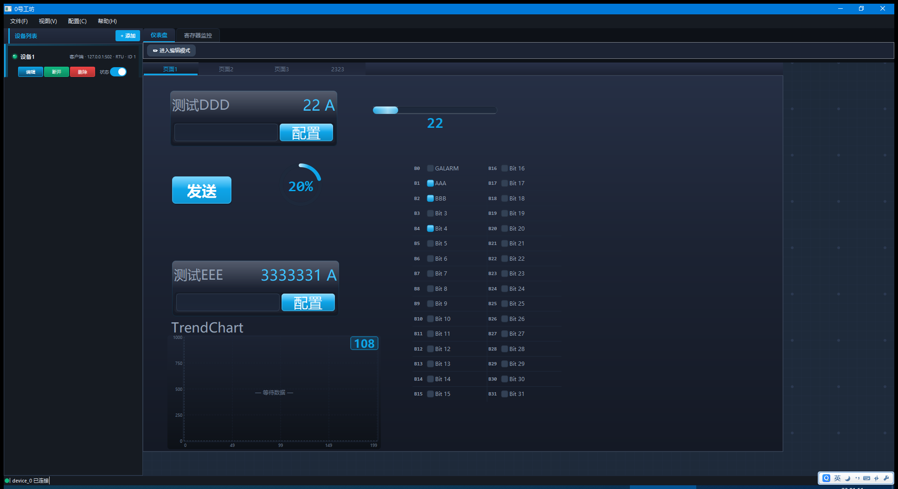

# Studio 0（0号工坊）— 专业 Modbus 调试工具

  
  
  
  

> 一款面向工业自动化的 Modbus 调试与上位机工具：**无需写代码**即可完成寄存器监控与可视化组态，**少量 Python** 即可扩展自定义逻辑。

---

## 一、简介
Studio 0 集 Modbus 主/从站调试、寄存器监控、协议报文分析、数据记录与可视化组态于一体，支持 **RTU / ASCII / TCP / IP** 多种协议，连接方式涵盖 **COM / TCP 客户端·服务器 / UDP 客户端·服务器**。

## 二、界面概览
- **连接区**：选择协议与连接方式，配置串口 / 网络参数，一键连接。
- **寄存器监控**：批量添加寄存器，实时读值 / 写值，支持波形曲线与报警阈值。
- **报文日志**：收发报文十六进制 / 文本视图，可过滤、高亮错误、导出。
- **组态画布**：拖拽控件搭建监控面板（数值、进度环、按钮等）。
- **脚本**：运行 Python 脚本实现自定义逻辑。

## 三、安装与运行
1. 从 [Releases](https://github.com/EveryIsZero/Studio-0/releases) 下载 `Studio 0 Release_Vx.x.x.x.zip`。
2. 解压到任意目录，**无需安装**，双击 `Studio 0.exe` 即可运行。
3. 若提示缺少运行库，请安装 [Visual C++ Redistributable](https://learn.microsoft.com/cpp/windows/latest-supported-vc-redist)。

> 系统要求：Windows 10 / 11。程序已自带运行环境，无需预装 Python。

## 四、快速上手（3 步）
1. **建连接**：连接区选协议（如 Modbus TCP）+ 连接方式（TCP 客户端），填 IP / 端口，点「连接」。
2. **加寄存器**：寄存器监控中点「批量添加」，设置从站地址、功能码、起始地址、数量。
3. **读 / 写 / 看**：点「读取」实时刷新；双击单元格写值；勾选「波形」看趋势。

## 五、核心功能
| 功能 | 说明 |
|------|------|
| 多协议 | RTU / ASCII / TCP / IP，主从站全角色 |
| 多种连接 | COM / TCP 客户端·服务器 / UDP 客户端·服务器 |
| 寄存器监控 | 批量读写、定时轮询、波形曲线、报警阈值 |
| 报文分析 | 收发日志十六进制 / 文本、错误高亮、导出 |
| 可视化组态 | 拖拽控件搭建监控面板，支持数值 / 进度环 / 按钮等 |
| 数据记录 | 导出 CSV / 数据库，历史回放 |
| 脚本扩展 | 运行 Python 脚本实现自定义逻辑 |

## 六、常见问题
| 问题 | 解决 |
|------|------|
| 连不上设备 | 检查 IP / 端口、串口占用、防火墙；确认协议与设备一致 |
| 读不到数据 | 核对从站地址、功能码、寄存器地址范围 |
| 界面字体异常 | 不要将程序放在含中文 / 空格过深的路径 |
| 提示缺少 DLL | 安装 Visual C++ Redistributable |

## 七、许可与反馈
- 本工具为**免费发布版**，仅供学习与技术交流。
- 问题反馈 / 建议：在 [Issues](https://github.com/EveryIsZero/Studio-0/issues) 提交。
- 若对您有帮助，欢迎扫码支持（见发行包内捐赠码）。

  Made with by <a href="https://github.com/EveryIsZero">EveryIsZero</a>

